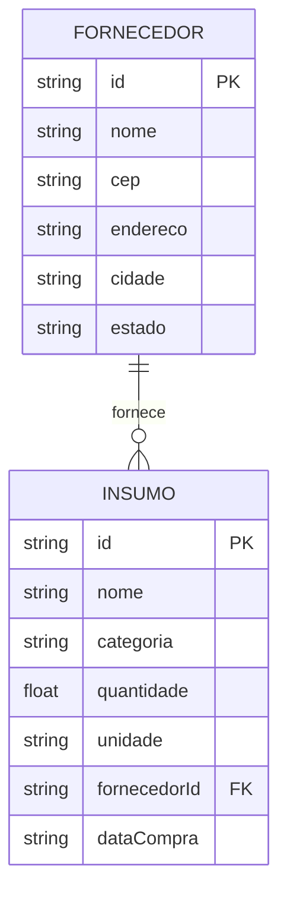

# 🛠️ Especificação Técnica (Tech Spec) - AgroStock

Este documento detalha a arquitetura técnica, o modelo de dados e os contratos de API (via JSON Server) necessários para o funcionamento do sistema de controle de insumos agrícolas AgroStock.

---

## 1. Modelo de Dados (Diagrama ER)

Abaixo está o Diagrama Entidade-Relacionamento (DER) que representa a estrutura do nosso "banco de dados" (`db.json`) e como as informações se conectam.

2. Dicionário de Dados
🌾 Insumos

Responsável por armazenar os produtos agrícolas cadastrados no sistema.

id: Identificador único gerado pelo JSON Server.
nome: Nome do insumo (ex: Fertilizante NPK).
categoria: Tipo do insumo (fertilizante, semente, defensivo).
quantidade: Quantidade disponível (número positivo).
unidade: Unidade de medida (kg, litros, sacas).
fornecedorId: Referência ao fornecedor do insumo.
dataCompra: Data de aquisição do produto.
🏢 Fornecedores

Armazena informações dos fornecedores dos insumos.

id: Identificador único.
nome: Nome do fornecedor.
cep: CEP do fornecedor.
endereco: Endereço obtido via API.
cidade: Cidade do fornecedor.
estado: Estado do fornecedor.
3. Rotas da API (JSON Server)

A aplicação consome uma API fake utilizando JSON Server.

📦 Insumos
GET /insumos → Retorna todos os insumos cadastrados
POST /insumos → Cadastra um novo insumo
GET /insumos/{id} → Retorna um insumo específico
PUT /insumos/{id} → Atualiza um insumo
DELETE /insumos/{id} → Remove um insumo
🏢 Fornecedores
GET /fornecedores → Lista fornecedores
POST /fornecedores → Cadastra fornecedor
GET /fornecedores/{id} → Retorna fornecedor específico
4. Estrutura do Banco de Dados (db.json)
{
  "fornecedores": [
    {
      "id": "1",
      "nome": "Cooperativa Agrícola",
      "cep": "85000-000",
      "endereco": "Rua das Plantas, 123",
      "cidade": "Guarapuava",
      "estado": "PR"
    }
  ],
  "insumos": [
    {
      "id": "1",
      "nome": "Fertilizante NPK",
      "categoria": "Fertilizante",
      "quantidade": 50,
      "unidade": "kg",
      "fornecedorId": "1",
      "dataCompra": "2026-03-15"
    },
    {
      "id": "2",
      "nome": "Semente de Soja",
      "categoria": "Semente",
      "quantidade": 30,
      "unidade": "sacas",
      "fornecedorId": "1",
      "dataCompra": "2026-03-18"
    }
  ]
}
5. Integração com API Pública

A aplicação utilizará a API de CEP (ViaCEP) para preenchimento automático de endereço.

🔗 Exemplo de requisição
https://viacep.com.br/ws/{cep}/json/
🔄 Fluxo
Usuário digita o CEP
Sistema faz requisição à API
Campos de endereço são preenchidos automaticamente
6. Tecnologias e Dependências
Frontend: HTML5, CSS3, JavaScript
Framework CSS: Bootstrap
Biblioteca JS: jQuery
API Fake: JSON Server
Persistência: localStorage e JSON Server
7. Fluxo de Cadastro de Insumo
Usuário preenche formulário
Sistema valida os dados
Sistema envia requisição POST /insumos
JSON Server retorna o insumo criado
Interface é atualizada com o novo item
Mensagem de sucesso é exibida
8. Fluxo de Consulta de CEP
Usuário digita CEP
Sistema faz requisição à API ViaCEP
Se válido:
→ Preenche endereço automaticamente
Se inválido:
→ Exibe mensagem de erro
9. Tratamento de Erros
Campos obrigatórios não preenchidos
Quantidade inválida (número negativo)
CEP inválido
Erros de requisição (API fora do ar)
Falha ao salvar dados
10. Regras de Negócio
Quantidade deve ser sempre maior que zero
Nome do insumo é obrigatório
CEP deve ser válido
Um insumo deve estar vinculado a um fornecedor
Exclusão de insumo remove o item da listagem
