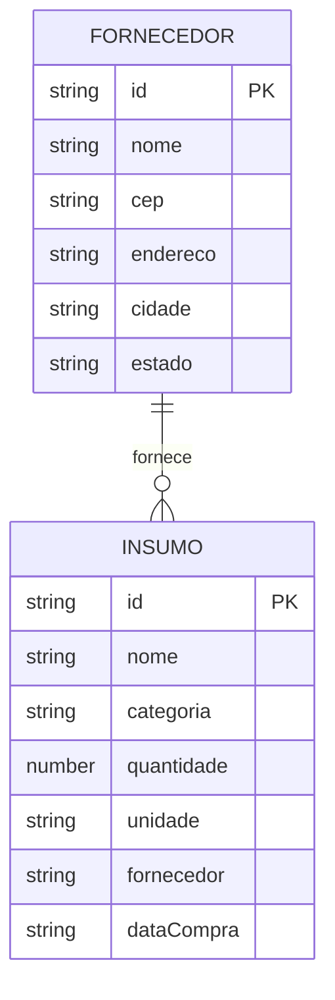

# 🛠️ Especificação Técnica (SDD / Tech Spec) - AgroStock

Este documento detalha a arquitetura técnica, o Design System, o modelo de dados e os contratos de API necessários para o funcionamento do sistema de controle de insumos agrícolas **AgroStock**.

---

## 1. Framework CSS

**Bootstrap 5.3** — instalado via npm e servido localmente a partir de `assets/vendor/bootstrap/` (sem CDN).

```
assets/vendor/bootstrap/bootstrap.min.css
assets/vendor/bootstrap/bootstrap.bundle.min.js
```

> Tailwind CSS não é utilizado nesta disciplina.

---

## 2. Design Tokens

### 2.1 Paleta de Cores (Material Design 3 — tema agrícola)

| Token CSS | Valor HEX | Uso |
|---|---|---|
| `--agro-primary` | `#17330e` | Cor principal — botões, links ativos, destaques |
| `--agro-primary-container` | `#2d4a22` | Fundo de sidebar ativa, hover |
| `--agro-primary-fixed` | `#c9edb6` | Badges, destaques claros |
| `--agro-secondary` | `#79564b` | Terracota — cor de apoio |
| `--agro-secondary-container` | `#fed0c1` | Fundo de alertas secundários |
| `--agro-tertiary` | `#352b1b` | Marrom escuro — textos de apoio |
| `--agro-surface` | `#fcf9f7` | Fundo geral da página |
| `--agro-surface-low` | `#f6f3f1` | Fundo da sidebar |
| `--agro-surface-container` | `#f0edeb` | Fundo de cards e painéis |
| `--agro-on-surface` | `#1b1c1b` | Texto principal |
| `--agro-on-surface-variant` | `#43483f` | Texto secundário / labels |
| `--agro-outline` | `#73796e` | Bordas e divisores |
| `--agro-error` | `#ba1a1a` | Estados de erro e alertas |
| `--agro-error-container` | `#ffdad6` | Fundo de mensagens de erro |

**Justificativa da paleta:** Tons de verde-floresta e marrom evocam o universo agrícola e oferecem contraste AAA em fundos neutros quentes.

### 2.2 Tipografia

| Papel | Fonte | Uso |
|---|---|---|
| **Body / Interface** | `Inter` (Google Fonts) | Texto corrido, labels, tabelas |
| **Display / Headers** | `Manrope` (Google Fonts) | Títulos, métricas numéricas, sidebar |

Escala tipográfica usa `rem` e `clamp()` para responsividade fluida.

---

## 3. Componentes Bootstrap — Mapeamento para Substituição no Protótipo

Os componentes abaixo foram identificados no protótipo (Figma/Stitch) como candidatos diretos à substituição pelas classes Bootstrap 5.3:

| # | Componente do Protótipo | Componente Bootstrap | Arquivo de uso |
|---|---|---|---|
| 1 | Barra de navegação lateral (mobile) | **Offcanvas** (`offcanvas-start`) | Todas as páginas |
| 2 | Cards de KPI no dashboard | **Card** (`card`, `card-body`) | `index.html` |
| 3 | Tabela de insumos em estoque | **Table** (`table table-hover table-striped`) | `estoque.html` |
| 4 | Janela de confirmação de exclusão | **Modal** (`modal`, `modal-dialog`) | `estoque.html`, `detalhes.html` |
| 5 | Notificações de sucesso/erro | **Toast** (`toast`, `toast-container`) | Todas as páginas |

> Os itens 1, 2 e 3 são os **3 mínimos obrigatórios** para a Entrega 1.

---

## 4. Modelo de Dados (Diagrama ER)

Abaixo está o Diagrama Entidade-Relacionamento (DER) que representa a estrutura do nosso "banco de dados" (`db.json`) e como as informações se conectam.



## 5. Dicionário de Dados
🌾 Insumos
Responsável por armazenar os produtos agrícolas cadastrados no sistema.

id          : Identificador único gerado pelo JSON Server
nome        : Nome do insumo (ex: Fertilizante NPK)
categoria   : Tipo do insumo (fertilizante, semente, defensivo)
quantidade  : Quantidade disponível (número positivo)
unidade     : Unidade de medida (kg, litros, sacas)
fornecedor  : Nome do fornecedor do insumo (denormalizado — string)
dataCompra  : Data de aquisição do produto

🏢 Fornecedores
Armazena informações dos fornecedores dos insumos.

id       : Identificador único
nome     : Nome do fornecedor
cep      : CEP do fornecedor
endereco : Endereço obtido via API
cidade   : Cidade do fornecedor
estado   : Estado do fornecedor

## 6. Rotas da API (JSON Server)
A aplicação consome uma API fake utilizando JSON Server.
📦 Insumos

GET    /insumos         → Retorna todos os insumos cadastrados
POST   /insumos         → Cadastra um novo insumo
GET    /insumos/{id}    → Retorna um insumo específico
PUT    /insumos/{id}    → Atualiza um insumo
DELETE /insumos/{id}    → Remove um insumo

🏢 Fornecedores

GET    /fornecedores      → Lista fornecedores
POST   /fornecedores      → Cadastra fornecedor
GET    /fornecedores/{id} → Retorna fornecedor específico

Nota: PUT e DELETE para fornecedores podem ser implementados posteriormente, se necessário.
## 7. Estrutura do Banco de Dados (exemplo de db.json)

```json
{
  "fornecedores": [
    {
      "id": "1",
      "nome": "Cooperativa Agrícola",
      "cep": "85000-000",
      "endereco": "Rua das Plantas, 123",
      "cidade": "Guarapuava",
      "estado": "PR"
    }
  ],
  "insumos": [
    {
      "id": "1",
      "nome": "Fertilizante NPK",
      "categoria": "Fertilizante",
      "quantidade": 50,
      "unidade": "kg",
      "fornecedor": "Cooperativa Agrícola",
      "dataCompra": "2026-03-15"
    },
    {
      "id": "2",
      "nome": "Semente de Soja",
      "categoria": "Semente",
      "quantidade": 30,
      "unidade": "sacas",
      "fornecedor": "Cooperativa Agrícola",
      "dataCompra": "2026-03-18"
    }
  ]
}
```

## 8. Integração com APIs Públicas

### 8.1 ViaCEP — Preenchimento automático de endereço

```
GET https://viacep.com.br/ws/{cep}/json/
```

**Fluxo:**
1. Usuário digita o CEP no formulário de fornecedor
2. Sistema faz requisição à API ViaCEP
3. Campos `endereco`, `cidade` e `estado` são preenchidos automaticamente
4. CEP inválido → exibe mensagem de erro inline

### 8.2 Open-Meteo — Dados climáticos no Dashboard

```
GET https://api.open-meteo.com/v1/forecast?latitude={lat}&longitude={lon}&current_weather=true
```

**Fluxo:**
1. Dashboard requisita clima atual baseado na localização configurada
2. Exibe temperatura e condição no card meteorológico
3. Falha de rede → card exibe estado de erro sem quebrar o layout

## 9. Tecnologias e Dependências

| Camada | Tecnologia | Versão |
|---|---|---|
| Frontend | HTML5, CSS3, JavaScript (ES6+) | — |
| Framework CSS | **Bootstrap** (npm local) | 5.3 |
| Pré-processador CSS | Sass (SCSS) | ^1.99.0 |
| Biblioteca JS | jQuery | ^3.7.1 |
| Máscara de campo | jQuery Mask Plugin | ^1.14.16 |
| API Fake | JSON Server | ^1.0.0-beta.3 |
| Linter | ESLint | ^9.39.4 |
| Formatador | Prettier | ^3.8.2 |

## 10. Fluxo Principal – Cadastro de Insumo

Usuário preenche formulário
Sistema valida os dados
Sistema envia requisição POST /insumos
JSON Server retorna o insumo criado
Interface é atualizada com o novo item
Mensagem de sucesso é exibida

## 11. Tratamento de Erros (principais casos)

- Campos obrigatórios não preenchidos → highlight vermelho + mensagem inline
- Quantidade inválida (≤ 0) → bloqueia submit
- CEP inválido ou não encontrado → exibe toast de erro
- Erros de requisição (API fora do ar) → exibe mensagem amigável, sem crash
- Falha ao salvar dados → reverte estado e exibe feedback

## 12. Regras de Negócio

- Quantidade deve ser sempre maior que zero
- Nome do insumo é obrigatório
- CEP deve ser válido (8 dígitos)
- Um insumo deve estar vinculado a um fornecedor existente
- Exclusão de insumo remove o item da listagem imediatamente (sem refresh manual)
